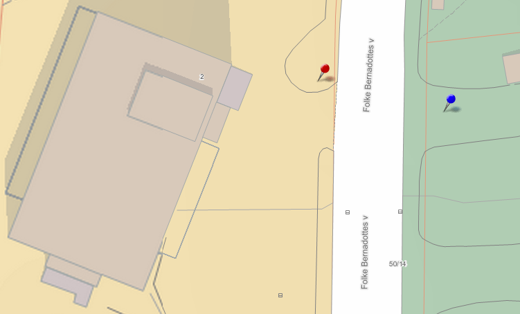

Brannvern
=========

Akutt
-----

Om det brenner se [denne siden](/akkutt/).

Utstyr leiligheter
------------------

I alle leiligheter skal der være utstyrt
- håndslukkeapparat
- godkjente røykvarsler(e)
- sentralkoblet brannsensor(er)

Røykvarsleren skal monteres slik at den høres tydelig på soverom når døren er lukket. Beboer har ansvar for vedlikehold og overvåking av egne røykvarslere. Vedlikehold er bl.a. testing av at batteriet og sjekke at varsleren ellers virker tilfredsstillende. Sameier må selv skifte egne røykvarslere. Det er beboer som har ansvar for vedlikeholdet og kontrollen av brannslukkingsutstyret i egen boenhet. Foreta kontroll av pulverapparatet minst én gang i året, se at manometernålen står på grønt. Vend på apparatet minst én gang i året, slik at pulveret ikke klumper seg. Sjekk at splinten er på plass, pass på at apparatet blir etterfylt etter bruk.

For mer informasjon om krav til din bolig se [Brann- og redningsetaten sine sider](https://www.oslo.kommune.no/brannvern-ildsted-og-feiing/).

NB: Se lenger ned på siden for informasjon om vår årlige brannkontrollsavtale.

Utstyr fellesarealer
--------------------

Det er montert brannsensorer i fellesarealene til sameiet, tilkoblet brannsentralen som er montert rett innenfor inngangsdørene. Sameiet har ansvar for dette utstyret. [Ta kontakt med styret](/kontakt/) hvis det er oppdaget feil eller mangler på brannvernutstyret i fellesområder.

Rømningsveier
-------------

Rømningsveiene skal til enhver tid være ryddige og fri for hindringer. Brukerne har ansvar for å holde rømningsveiene ryddige, og ikke hindre framkommelighet for brannvesenet eller andre redningsbiler.

Branninstruks
-------------

### Alltid

- Last ned og gjør det kjent med "Brannsjekken" fra [Brann- og redningetaten](http://www.brann-og-redningsetaten.oslo.kommune.no/om_oss/publikasjoner_og_statistikk/brosjyrer/).
- Hold deg alltid orientert om:
  - Rømningsveier og møteplasser.
  - Slukkeutstyrs plassering.
  - Hvordan håndslukkere og brannslanger fungerer.

### Ved brann

- *Varsle*: Ring Brannvesen på nødnummer 110. Oppgi eget navn, adressse, telefonnummer, leilighetsnummer og etasjen du bor i. Oppgi hvor i leiligheten det brenner, og hva som brenner.
- *Redde*: Bistå med evakuering ved brann.
- *Slukke*: Prøv å begrense brannen ved å lukke alle dører og vinduer. Prøv å slukke brannen med brannslukningsapparat/håndlsange.
- Entrédøren til leiligheten **må** holdes lukket dersom det brenner i leiligheten. I tillegg til balkongdør og vinduer. Pass på at entrédøren er lukket når du forlater leiligheten.

### Ved evakuering

- Gå ut av leiligheten, og hvis mulig gå ned trappen, og ut av blokken. **Heisen må ikke brukes ved brann**.
- Hvis det ikke er mulig å komme ut av leiligheten, gå ut på balkongen, vent på brannvesenet.
- **Entredøren til leiligheten MÅ holdes lukket**.
- Dersom det er mulig, varsle naboene om brannen.
- Enhver beboer plikter å bidra til å forebygge brann.
- Fellesarealer, som ganger og trappeoppgang skal til enhver tid holdes ryddig og ha fri passasje.

### Møteplasser

Møteplassene M1 (rød markør, ved falggstangen) og M2 (blå markør, på andre siden av veien) er merket på kartutsnittet under.

Brannsentralen varslingsanlegg
------------------------------

Brannvarslingssentralen i Sameiet opereres av [Styret](/styret). Dersom ingen av styret er tilgjengelig, slå av alarmen og send en melding. Nøyaktige instruksjoner bør legges ut her snart.

Deaktivering av alarm
---------------------

Man må ikke deaktivere alarmen om man ikke er 100% sikker på at det ikke brenner.

Dersom alarmen går, oppsøk en sentral for å finne ut hvor det brenner. Dersom det er brann, ring brannvesenet. Ikke slå av alarmen før det er bekreftet at brannen er slukket.

Hvis alarmen var utløst av stekos, og faren er over, slå av alarmen og send en melding om hva som har skjedd til [Styret](/styret/).

