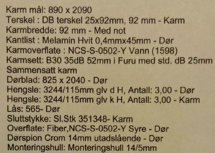

# Oppussing og vedlikehold

## Husk

Husk at alt arbeid i leilighetene og gårdene ellers skal følge gjeldende forskrifter (pass særlig på brannsikringsforskriftene).

Blokkene er ikke klassifisert som særskilte brannobjekt av brannvesenet, men siden det bare er én skikkelig rømningsvei kreves det at firmaer som prosjekterer arbeid av brannteknisk karakter må ha sertifisering for arbeid på slike bygg.

## Omfattende arbeid

Ved omfattende oppussing som el-, VVS-arbeid og betongsaging skal [styret kontaktes](/styret/) på forhånd, i god tid. Vi henstiller til sameierene om å benytte ["våre" tilknyttede håndverkere](/handverkere/) som er kjent med el- og røropplegg i blokken. Oppussing av bad skal utføres av fagfolk med våtromssertifikat. Alle endringer i vegger o.l. må godkjennes av styret. Om man må stenge vannet må man i forkant få godkjenning av styret.

Alt arbeid på bærevegger, baderom og andre vesentlige endringer er søknadspliktig til [Plan- og bygningsetaten](https://www.oslo.kommune.no/plan-bygg-og-eiendom/). Seksjonseier er ansvarlig for å sende søknad og meldinger i samsvar med [Plan- og bygningsloven](https://lovdata.no/dokument/NL/lov/2008-06-27-71) samt andre lover og forskrifter. Seksjonseier er ansvarlig for at alt arbeid blir utført i henhold til teknisk forskrift. D.v.s. at alle brannkrav og krav til vannskadesikkerhet må følges.

Ved større og langvarige oppussingsarbeider, samt stenging av vann, skal alle beboere informeres i god tid før arbeidet begynner.

Ved særlig støyende arbeid, som for eksempel pigging av badegulv og omfattende betongborearbeider, skal beboerne ha beskjed minst 2 dager i forveien slik at de kan sørge for alternativt arbeidssted / sovested.

## Entrédør

Entrédører til leiligheter skal være av type [nordic B-30/35 dB](http://www.nordicdoor.no/sider/tekst.asp?side=82) eller bedre. Disse dørene følger brannforskrifter (hver leilighet er en egen branncelle), og dørene er både brann- og røyksikker, dimensjonert for å tåle minimum 30 minutter brann ([type B30 dør](http://snl.no/brann/brannklassifisering)) samt lydisolert (35 db). Husk at det skal branntettes med godkjent materiale etter gjeldende forskrifter. Døren skal merkes med navn skilt ([les mer](/skilt/)), samt Sameiets [leilighetsnummer](/om-sameiet/seksjonene/) oppe i venstre hjørne av døren. For bolignummer [se denne siden](/nyttig/bolignummer/).

Følgende spesifikasjoner gjelder for våre entrédører:

## Ventilasjon

Det er viktig at ventilasjonen blir opprettholdt som tidligere. Ingen ventilasjons­luker må stenges eller monteres på en måte som fører til reduser luftinntak. Det SKAL monteres skikkelig kullfilter på kjøkkenvifter, og ikke monteres avtrekksvifter som kobles til ventilasjonsanlegget. Ikke monter avtrekksvifter på baderom eller i andre rom i leiligheten. Det er et velfungerende ventilasjonsanlegg i blokken som bl.a. suger ut fuktig luft fra baderommene. Dersom det monteres ekstra avtrekksvifter, fører dette til at matos og fuktig luft presses inn i andre leiligheter. Disse leilighetene får dermed ikke glede av ventilasjonsanlegget.

## Elektrisk

Les [Informasjon om elektrisk anlegg](/nyttig/elektrisk-anlegg/).

## Ringeklokker

Ved eventuelle feil på ringeklokke til seksjonen skal styret kontaktet. Styret har ansvaret for vedlikehold og reparasjoner av ringeklokkene til alle seksjoner.

## Sensor brannalarm

Ved oppussing må brannsensorer dekkes til med plastpose. Om dette ikke gjøres vil f.eks støv føre til uønskede alarmer. Maling, støv med mer kan også ødelegge de følsomme sensorene. Kostnad i forbindelse med reperasjon eller bytte av brannsensorer som følge av at man ikke følger disse reglene vil måtte dekkes av sameier.

## Vinduer

Hver seksjonseier er ansvarlig for sine egne vinduer. Dersom du ønsker å skifte vindu, må du få laget et vindu som ser ut som det gamle (samme ramme og farge).

## Balkongdører

Hver seksjonseier er ansvarlig for sine egne balkongdører. Dersom du ønsker å skifte balkongdør, må du få laget en dør som ser ut som det gamle (samme ramme og farge).

## Balkonger

Selv har man anledning til å fikse balkonggulvet, ved å legge fliser, teppe eller lignende. Men man må ikke gjøre noe som endrer fasaden, som maling eller fiksing av vegger, skillevegger eller tak. Se [regler for balkonger](/nyttig/balkonger/), samt [regler for ansvarsfordeling](/nyttig/ansvar/).

## Støy, skader og rot

Se [regler for ro](/nyttig/ro/). Det er IKKE anledning til å stenge vann, kople fra strøm e.l. uten etter avtale med styret. Alt støv og rot i fellesarealene skal fjernes samme dag. Dersom det er nødvendig, skal gulv og vegger vaskes. Skader på vegger, tak o.l. skal utbedres innen en uke.

## Bad

Ved oppussing og eller rehabilitering av alle bad i sameiet så skal dette gjøres i henhold til [Våtromsnormen](http://www.juss.info/vatromsnormen/).
