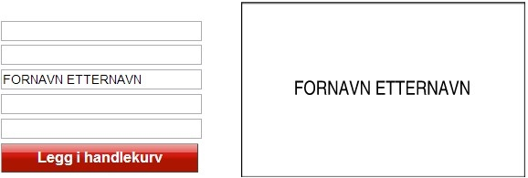
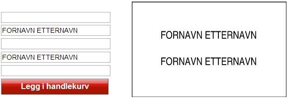
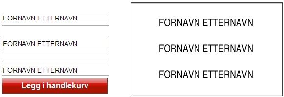

# Skilt

## Postkasseskilt

På postkassene er det kun godkjente postkasseskilt som skal benyttes, og det skal ikke settes opp lapper eller lignende.

Skiltene bestilles fra [Posten sin skiltbutikk](http://skiltbutikken.posten.no/variants/109).

## Reklame, nei takk

Heller ikke "nei til reklame" merkelapper skal festes på postkassen. Postkassen skal merkes med godkjente "nei til reklame"-skilt, som kan bestilles av [styret](/styret/), men betales av beboer.

## Annen merking på postkassene

Beboere som fester lapper på postkassene vil bli bedt om å fjerne disse. Om de ikke fjernes umiddelbart vil styret få det gjort, og de det gjelder vil bli fakturert for arbeidet. Blir det skader på postkassene som følge av merkelapper som ikke enkelt løsner vil beboere / sameiere vil bli fakturert for reparasjoner.

### Godkjent type skilt (merk at andre farger / størrelser ikke er godkjent)

- Hvitt rektangulært skilt med sort tekst. Plass til 23 tegn pr tekstlinje.
- Høyden på de store bokstavene er 5 mm og de små bokstavene 3,8 mm.
- Mål: 58x94mm

### Skilt skal fylles ut på følgende måte

Merk at _kun store bokstaver_ skal benyttes.

Ett navn på skilt:

To navn på skilt:

Tre navn på skilt:

[Klikk her]() for å komme til bestillingsside.

## Dørskilt

Dører til alle leiligheter skal merkes med navn til alle beboere. Beboere står selv fritt til å finne et skilt man liker. Skilt kan for eksempel kjøpes på [Jernia](https://www.jernia.no/), eller via [Posten sin skiltbutikk](http://skiltbutikken.posten.no/variants/109).

## Ringeklokketablå

For oppdatering av ringeklokketablå [kontakt styret](styret) med følgende informasjon:

- Navn til tablå.
- Leilighetsnummer.
